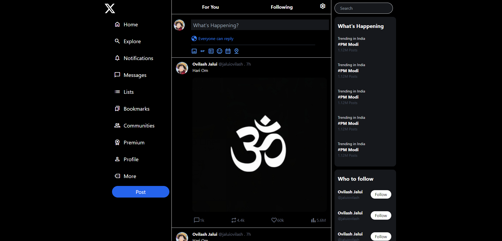

# Twitter UI Clone

### Home Page


This is a simple clone of the Twitter user interface built using HTML and TailwindCSS. This project serves as my first venture into using TailwindCSS for styling.

## Table of Contents

- [Overview](#overview)
- [Features](#features)
- [Technologies Used](#technologies-used)
- [Setup](#setup)
- [Screenshots](#screenshots)
- [Challenges and Learning](#challenges-and-learning)
- [License](#license)

## Overview

This project is a clone of the Twitter UI, designed to replicate the look and feel of the platform. The primary goal was to get hands-on experience with TailwindCSS and understand how to quickly style components using utility-first CSS.

## Features

- Responsive layout
- Navigation bar
- Sidebar with icons
- Main feed section
- Explore, notifications, messages, and profile pages
- Post button with icons for media, GIFs, polls, and more

## Technologies Used

- **HTML**: Structuring the webpage
- **TailwindCSS**: Styling and layout

## Setup

1. Clone the repository:
   ```bash
   git clone https://github.com/yourusername/twitter-ui-clone.git
   ```
2. Navigate to the project directory:
   ```bash
   cd twitter-ui-clone
   ```
3. Open `index.html` in your preferred browser to view the project.

## Challenges and Learning

This was my first project using TailwindCSS. I learned how to:

- Utilize Tailwind's utility classes for rapid styling.
- Create responsive designs that adapt to different screen sizes.
- Use Tailwind's flexbox utilities to structure components.

## License

This project is licensed under the MIT License - see the [LICENSE](LICENSE) file for details.
